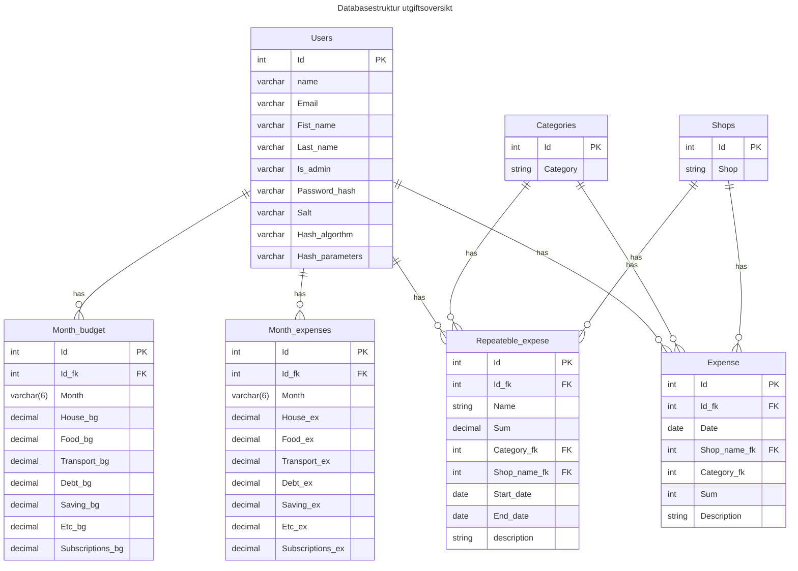
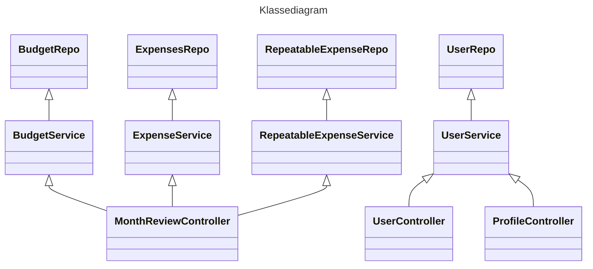

### Innhold
- Funksjoner
- Krav
- Frontend design
- Valg av teknologi
- C4 diagram
- API endepunkter
- Databasestruktur
- Klassediagram
- Mappestruktur

## Funksjoner
Funksjoner brukeren trenger:
- Registrering av bruker
- Innlogging av bruker
- CRUD budsjett
- CRUD utgifter
- Se sammenheng mellom utgifter og budsjett
- Autentisering og autorisering av brukere
- Mulig å opprette faste utgifter som genereres til utgift hver gang en ny måned begynner

### Andre funksjoner (Ekstrafunksjoner)
Funksjonalitet som er ønskelig, men ingen krav for MVP
- Sortere utgifter
- Filtrere utgifter
- Se sammendrag av gitt måned
  - Hvor mye +- budsjettet
- Lage egne samlinger av utgifter med tags
  - Gave, forsikringer++ 


## Krav
- **Funksjonelle krav**:
  - CRUD-operasjoner (opprett, les, oppdater, slett).
  - Autentisering og autorisering
  - Håndtering av brukerdata, for eksempel utgifter
  - Integrasjon med en database.
  
- **Ikke-funksjonelle krav**:
  - Sikkerhet

# Frontend design
Usikker om dette er litt for ambesiøst, eller mulig for dette prosjektet


# Valg av teknologi
- **Backend**:
  - **.NET Core** (for RESTful API).
  - **Entity Framework Core** for databaseinteraksjoner.
  - **Azure SQL Database** (eller annen database hvis du ønsker).
  - **Authentication (JWT eller OAuth)** hvis autentisering er nødvendig.

- **Frontend**:
  - **React** for brukergrensesnittet.
  - **Axios eller Fetch API** for å kommunisere med backend.
  - **Material-UI eller Bootstrap** for styling (valgfritt).

- **CI/CD**:
  - **Azure DevOps eller GitHub Actions?** for bygg og deploy pipelines.
  - **GitHub** for kildekodehåndtering.

- **Hosting**:
  - **Azure Static Web Apps** for frontenden (React).
  - **Azure App Service** for å hoste RESTful API-et.
# C4 diagrammer

  C1           |  C2         |C3
:-------------------------:|:--------------------------:|:--------------------------:|
Viser systemets høy-nivå oversikt og dets relasjoner til eksterne aktører.           |Viser hovedkomponentene i systemet og hvordan de kommuniserer.          |Viser detaljene inne i Backend (.NET).
             |            | 


# API endepunkter
| HTTP Method | Endepunkt                             | Beskrivelse                                               |
|-------|---------------------------------------------|-----------------------------------------------------------|
| GET   | /users                                      | Henter alle brukere                                       |
| GET   | /users/{user_id}                             | Henter en spesifikk bruker                                |
| POST  | /users                                      | Oppretter en ny bruker                                    |
| PUT   | /users/{user_id}                             | Oppdaterer en spesifikk bruker                            |
| DELETE| /users/{user_id}                             | Sletter en spesifikk bruker                               |
|       |                                             |                                                           |
| POST  | /login/                                     | Logger inn bruker med epost og hashet passord             |
| POST  | /logout/                                    | Logger ut en bruker med gyldig session                    |
|       |                                             |                                                           |
| GET   | /users/{user_id}/expenses                    | Henter alle utgifter for en bruker                        |
| GET   | /users/{user_id}/expenses/{expense_id}        | Henter en spesifikk utgift for en bruker                  |
| POST  | /users/expenses                             | Oppretter en ny utgift for en bruker                      |
| PUT   | /users/expenses/{user_id}                    | Oppdaterer en spesifikk utgift for en bruker              |
| DELETE| /users/expenses/{user_id}                    | Sletter en spesifikk utgift for en bruker                 |
|       |                                             |                                                           
| GET   | /users/monthly_overview/{month_id}            | Henter sammendrag for spesifikk måned YYYMM               |
|       |                                             |                                                           |
| GET   | /users/{user_id}/budget/                     | Henter budsjett for en spesifikk bruker                   |
| PUT   | /users/{user_id}/budget/                     | Oppdatere budsjett for en spesifikk bruker                |
|       |                                             |                                                           |
| GET   | /users/{user_id}/repeating_expenses/          | Henter alle faste utgifter for en spesifikk bruker        |
| GET   | /users/{user_id}/repeating_expenses/{rep_ex_id} | Henter en spesifikk faste utgifter for en spesifikk bruker|
| POST  | /users/{user_id}/repeating_expenses/          | Oppretter en ny fast utgift for en spesifikk bruker       |
| PUT   | /users/{user_id}/repeating_expenses/{rep_ex_id} | Oppdaterer en fast utgift for en spesifikk bruker         |
| DELETE| /users/{user_id}/repeating_expenses/{rep_ex_id} | Sletter en fast utgift for en spesifikk bruker            |

# Databasestruktur


<!--
## Brukertabell

### Users
Tabellen lagrer brukere, rettigheter (Is_admin) og deres innlogging
```sql
CREATE TABLE Users (
    Id INT IDENTITY(1,1) PRIMARY KEY,           -- Unik identifikator for brukeren, automatisk generert
    Email VARCHAR(255) NOT NULL UNIQUE,         -- Brukerens e-postadresse, må være unik
    First_name VARCHAR(100) NOT NULL,           -- Brukerens fornavn
    Last_name VARCHAR(100) NOT NULL,            -- Brukerens etternavn
    Is_admin BIT NOT NULL DEFAULT 0,            -- Angir om brukeren er administrator (0 = Nei, 1 = Ja)
    Password_hash VARBINARY NOT NULL,           -- Den hashede versjonen av passordet
    Salt VARBINARY NOT NULL,                    -- Saltet brukt sammen med passordet
    Hash_algorithm VARCHAR(50) NOT NULL,        -- Navn på hashing-algoritmen brukt (f.eks. bcrypt)
    Hash_parameters VARCHAR(100) NULL           -- Eventuelle parametere brukt for hashing (f.eks. antall iterasjoner)
);
```

### Expenses
Tabellen lagrer alle utgifter relatert til en bruker
```sql
CREATE TABLE Expenses (
    Id INT PRIMARY KEY IDENTITY(1,1),                 -- Automatisk generert ID
    Id_fk INT NOT NULL,                               -- Ref. til bruker
    Date DATE NOT NULL,                               -- Dato for utgiften
    Category_fk INT NOT NULL,                         -- Ref. til Categories
    Sum DECIMAL(10, 2) NOT NULL,                      -- Beløp for utgiften
    Shop_name_fk VARCHAR(100),                        -- Ref. til butikknavn
    Description VARCHAR(255),                         -- Kort beskrivelse av utgiften
    CONSTRAINT FK_user_expense FOREIGN KEY (Id_fk) 
        REFERENCES Users(Id) ON DELETE CASCADE
    CONSTRAINT FK_category FOREIGN KEY (Category_fk)
        REFERENCES Categories(Id) ON DELETE CASCADE
    CONSTRAINT FK_shop_name FOREIGN KEY (Shop_name_fk)
        REFERENCES Shops(Id) ON DELETE CASCADE
);
```

### Monthly_budget
Tabellen lagrer totalt budsjett fordelet på kategorieene, samt hvordan pengene fordeler seg, samt utrenet totale utgifter.
```sql
CREATE TABLE Monthly_budget (
    Id INT PRIMARY KEY IDENTITY(1,1),                 -- Automatisk generert ID
    Id_fk INT NOT NULL,                               -- Referanse til bruker
    Month VARCHAR(6) NOT NULL,                        -- Måneden dette budjsettet er gjeldende
    House_bg DECIMAL(10, 2) NOT NULL,                 -- Budsjett på aktuell kategori
    Food_bg DECIMAL(10, 2) NOT NULL,                  -- Budsjett på aktuell kategori
    Transport_bg DECIMAL(10, 2) NOT NULL,             -- Budsjett på aktuell kategori
    Debt_bg DECIMAL(10, 2) NOT NULL,                  -- Budsjett på aktuell kategori
    Saving_bg DECIMAL(10, 2) NOT NULL,                -- Budsjett på aktuell kategori
    Etc_bg DECIMAL(10, 2) NOT NULL,                   -- Budsjett på aktuell kategori
    Subscriptions_bg DECIMAL(10, 2) NOT NULL,         -- Budsjett på aktuell kategori
    Budget_tot DECIMAL(18,2) NOT NULL,                -- Totalt budsjett for måneden
    CONSTRAINT Fk_User_budget FOREIGN KEY (Id_fk) 
        REFERENCES Users(Id) ON DELETE CASCADE
);
```

### Monthly_expenses
Tabellen lagrer totalt budsjett fordelet på kategorieene, samt hvordan pengene fordeler seg, samt utrenet totale utgifter.
```sql
CREATE TABLE Monthly_expenses (
    Id INT PRIMARY KEY IDENTITY(1,1),                   -- Automatisk generert ID
    Id_fk INT NOT NULL,                                 -- Referanse til bruker
    Month VARCHAR(6) NOT NULL,                          -- Måneden dette budjsettet er gjeldende
    House_ex DECIMAL(10, 2) NOT NULL,                   -- Utgift på aktuell kategori
    Food_ex DECIMAL(10, 2) NOT NULL,                    -- Utgift på aktuell kategori
    Transport_ex DECIMAL(10, 2) NOT NULL,               -- Utgift på aktuell kategori
    Debt_ex DECIMAL(10, 2) NOT NULL,                    -- Utgift på aktuell kategori
    Saving_ex DECIMAL(10, 2) NOT NULL,                  -- Utgift på aktuell kategori
    Etc_ex DECIMAL(10, 2) NOT NULL,                     -- Utgift på aktuell kategori
    Subscriptions_ex DECIMAL(10, 2) NOT NULL,           -- Utgift på aktuell kategori
    CONSTRAINT FK_User_expenses FOREIGN KEY (Id_fk) 
        REFERENCES Users(Id) ON DELETE CASCADE
);
```

### Repeateble_expenses
En tabell som inneholder alle repeterende utgifter. Målet med denne tabellen er å automatisk opprette utgiftrader basert på om en fast utgift er aktiv eller ikke.
```sql
CREATE TABLE Repeateble_expenses (
    Id INT PRIMARY KEY IDENTITY(1,1),                   -- Automatisk generert ID
    Id_fk INT NOT NULL,                                 -- Referanse til Users
    Name VARCHAR(100) NOT NULL,                         -- Beskrivende navn av fast utgift
    Category_fk INT NOT NULL,                           -- Referanse til Categories
    Sum DECIMAL(10, 2) NOT NULL,                        -- Kostnad for abonnementet
    Shop_name_fk  INT NOT NULL,                         -- Navn på butikken/selskapet
    Start_date DATE NOT NULL,                           -- Når abonnementet startet
    End_date DATE NULL,                                 -- Når abonnementet slutter (NULL for aktivt abo.)
    Description VARCHAR(255),                           -- Beskrivelse av fast utgift
    CONSTRAINT FK_User FOREIGN KEY (Id_fk)
        REFERENCES Users(Id) ON DELETE CASCADE,
    CONSTRAINT FK_Category FOREIGN KEY (Category_fk)
        REFERENCES Categories(Id) ON DELETE CASCADE
    CONSTRAINT FK_shop_name FOREIGN KEY (Shop_name_fk)
        REFERENCES Shops(Id) ON DELETE CASCADE
);
```
Hensikten med denne tabellen er å opprette utgifter som er faste for hver måned. Det kan være husleie, eller internett, men også abonnementer på strømmetjenester.
For hver måned som opprettes vil disse automatisk bli lagt til som utgifter hvis de enda er aktive.

### Categories

```sql
CREATE TABLE Categories (
    Id INT PRIMARY KEY IDENTITY(1,1),               -- Automatisk generert ID
    Category VARCHAR(100)                           -- Kategorier, tilsvarer radene i expeses
);
```

### Shops

```sql
CREATE TABLE Shops (
    Id INT PRIMARY KEY IDENTITY(1,1),               -- Automatisk generert ID
    Shop_name VARCHAR(100)                          -- Butikknavn
);
```
-->
# Klassediagram



# JSON dokumentstruktur:

Users
``` json
Users: {
    User: {
        Id: "",
        Email: "",
        FirstName: "",
        LastName : "",
        IsAdmin: false,
        BudgetId: ""
    }
}
```

Months
``` json
Months: {
    Month: {
        Id: "", // Ref til userID i User dokument
        UserId: "",
        Month: ""
        BudgetId: ""
        House: "",
        Food: "",
        Transport: "",
        ...
    },
    Month: {
        Id: "", // Ref til userID i User dokument
        UserId: "",
        Month: ""
        BudgetId: ""
        House: "",
        Food: "",
        Transport: "",
        ...
    },
}
```
Expenses:
``` json
Expenses: {
    Expense: {
        Id: "",
        Month: "",
        USerId: "",
        Sum: "",
        Shop: "",
        Description: "",
        Category: ""
    }
    Expense: {
        Id: "",
        Month: "",
        USerId: "",
        Sum: "",
        Shop: "",
        Description: "",
        Category: ""
    }
}
```

```
Budgets
``` json
Budgets: {
    UserId: "",
    Budgets: [
        BudgetId: "", 
        //BudgetRows...
    ]
}

```
<!--
Users
``` json
Users: {
    User: {
        Id: "",
        Email: "",
        FirstName: "",
        LastName : "",
        IsAdmin: false,
        BudgetId: ""
    }
}
```

UserExpenses
``` json
UserExpenses: {
    Id: "", // Ref til userID i User dokument
    Months: [
        {
            Id: "",
            Month: "MMYY", // Kunne vært Id-en
            BudgetId: "",
            Expenses: [
                Expense {
                    Id: "",
                    Date: DateTime,
                    Shop: "",
                    Category: "",
                    Sum: 0.0,
                    Description: "",
                },
                Expense {
                    Id: "",
                    Date: DateTime,
                    Shop: "",
                    Category: "",
                    Sum: 0.0,
                    Description: "",
                }
            ]
        },
        {
            Id: "",
            Month: "MMYY",
            BudgetId: "",
            Expenses: [
                Expense {
                    Id: "",
                    Date: DateTime,
                    Shop: "",
                    Category: "",
                    Sum: 0.0,
                    Description: "",
                },
                Expense {
                    Id: "",
                    Date: DateTime,
                    Shop: "",
                    Category: "",
                    Sum: 0.0,
                    Description: "",
                }
            ]
        }
    ]
}

```
Budgets
``` json
Budgets: {
    UserId: "",
    Budgets: [
        BudgetId: "", 
        //BudgetRows...
    ]
}

```
-->